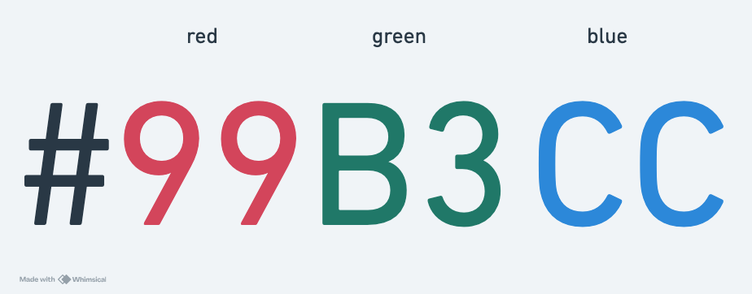

# Introduction to Stylesheets

* HTML is for structuring and defining content
* Stylesheets/CSS is for formatting content

## Formatting content with CSS

A Cascading Style Sheet (CSS) is a text file that contains rules that specify _how_ HTML elements are displayed on a web page.

### Syntax
```css
selector { property: value; property: value; }
```
`selector` is the HTML element (e.g. `header`, `p`) to be formatted.

**Example: Make the text of all paragraphs navy blue**
```css
p { color: navy; }
```

### Embedded style sheets


1. Insert `<style>` container inside `<head>` section of your HTML page.
2. Write style rules inside of `<style>` container.

```html
<!doctype html>
<html lang="en">
    <head>
        <title>My Doc</title>
        <style>
            p { color: navy; }
            h1 { font-size: 24px; }
        </style>
    </head>
    <body>
        <!-- some content should go here -->
    </body>
</html>
```

### Hexadecimal color values

* Several predefined values you can use for color values
* Hexadecimal values provide you with a wider range of potential colors
* Hexadecimal color values are codes that represent different RGB (red, green, blue) combinations


[color-hex.com page for #99b3cc](https://www.color-hex.com/color/99b3cc)

#### Shorthand values
* Hex colors with matching R, G, B values can have their pairs reduced to a single value
  * #33BBFF -> #3BF
  * #99AA99 -> #9A9